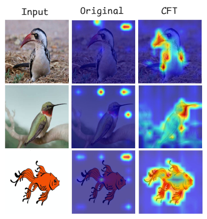
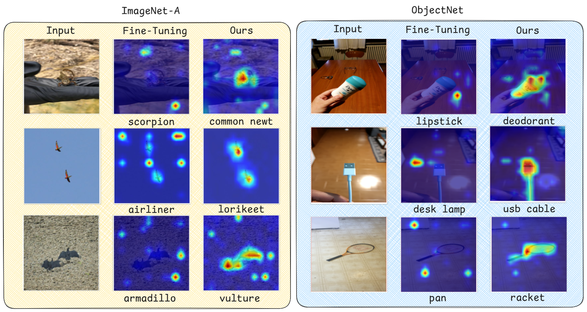

# Concept-Guided Fine-Tuning (CFT): Steering ViTs away from Spurious Correlations to Improve Robustness [CVPR 2026]
# **Official PyTorch Implementation**

[](https://github.com/yonisGit/cft)
[](https://github.com/yonisGit/cft)
[](https://opensource.org/licenses/MIT)

<p align="center">
  
</p>


## Overview
**Concept-Guided Fine-Tuning (CFT)** is a framework designed to enhance the out-of-distribution 
robustness of ViTs. Modern ViTs often suffer reliance on spurious correlations rather than the semantic features of the target object.

CFT addresses this by steering the model's internal reasoning toward **concept-level semantics** 
(e.g., focusing on the "beak" and "wings" of a bird instead of the background).


<p align="center">
  
</p>

## ⚙️ Installation & Usage

###  ️Setup
```bash
git clone https://github.com/yonisGit/cft.git
cd cft
pip install -r requirements.txt
```

### Generating Concept Maps
First, generate concept maps using the `generate_concept_segments.py` script:
```bash
python scripts/generate_concept_segments.py --dataset PATH_TO_IMAGENET --split val --limit 8 --save-concept-masks

```

### Fine-Tuning
To run CFT's fine-tuning, use the `train.py` script:

```bash
python scripts/train.py --concept_maps_data PATH_TO_CONCEPT_MAP_DATA --data PATH_TO_IMAGENET --gpu 0  --lr LEARNING_RATE --lambda_align 0.8 --lambda_acc 0.2 --lambda_ctx 1.2 --lambda_concept 0.5
```

### Datasets
Links for dataset download:
  * [ObjectNet](https://objectnet.dev/)
  * [SI-Score](https://github.com/google-research/si-score)    
  * [IN-A](https://github.com/hendrycks/natural-adv-examples)
  * [IN-R](https://github.com/hendrycks/imagenet-r)
  * [IN-V2](https://github.com/modestyachts/ImageNetV2)
  * [ImageNet-Segmentation](http://calvin-vision.net/bigstuff/proj-imagenet/data/gtsegs_ijcv.mat)
   

### Credits
* Relevance maps repositories used: [IIA](https://github.com/iia-iccv23/iia), [Pytorch-GradCAM](https://github.com/jacobgil/pytorch-grad-cam), [AttnLRP](https://github.com/hila-chefer/Transformer-Explainability).
* Our ViT models are based on the [timm](https://huggingface.co/timm), [DeiT](https://github.com/facebookresearch/deit), [DINOv2](https://github.com/facebookresearch/dinov2).
* Our ImageNet finetuning code is based on [code from the official PyTorch repo](https://github.com/pytorch/examples/blob/main/imagenet/main.py).


## Citing our work
Please cite our work if you use it in your research:
```
@article{elisha2026concept,
  title={Concept-Guided Fine-Tuning: Steering ViTs away from Spurious Correlations to Improve Robustness},
  author={Elisha, Yehonatan and Barkan, Oren and Koenigstein, Noam},
  journal={arXiv preprint arXiv:2511.13081},
  year={2026}
}
```


